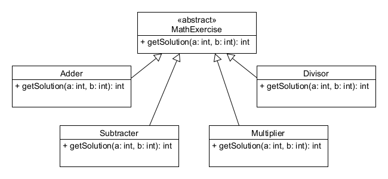
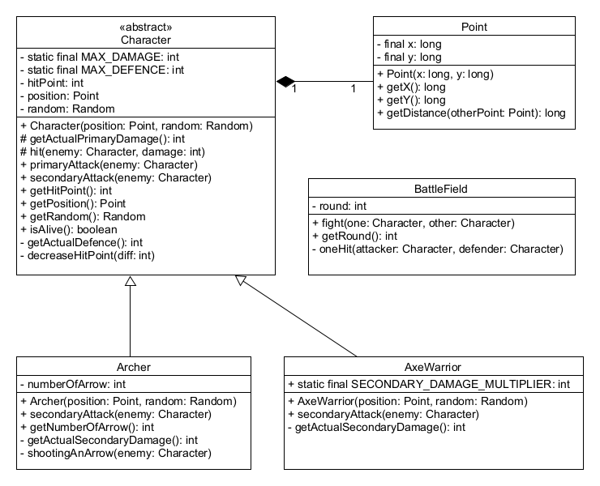

# Absztrakt osztályok

## Elmélet

**Absztrakt** az az **osztály**, amely valamilyen elvont fogalmat, csoportot reprezentál, ezért 
közvetlenül nincs értelme példányt létrehozni belőle. Arra használjuk, hogy a leszármazott speciális 
osztályokból összevonjuk a közös tulajdonságokat és viselkedést, még akkor is, ha nem biztos, 
hogy pontosan tudjuk, mit is kellene csinálnia egy-egy metódusnak. Absztrakt osztályt az osztálynév 
előtti `abstract` módosítószóval hozhatunk létre. Amennyiben nem tudjuk, hogy egy elvárt viselkedés 
pontosan mit is takar, akkor a metódus törzsét elhagyhatjuk. Ebben az esetben a metódust is el 
kell látnunk `abstract` módosítóval. Az absztrakt osztály leszármazottainak implementálniuk kell az 
**absztrakt metódusokat**, vagy ők is absztrakttá kell, hogy váljanak. Egy konkrét osztálynak nem lehet absztrakt metódusa.
Fontos megjegyezni, hogy az absztrakt osztály attól és csak attól absztrakt, hogy kiteszem elé az `abstract` 
módosítószót, és lehet absztrakt metódusa, de ez nem kötelező. Létezhet olyan absztrakt osztály, 
amelynek egyáltalán nincs egy absztrakt metódusa sem.

```java
public abstract class Animal {

    private String name;

    public String getName() {
        return name;
    }

    public abstract void move();
}

public abstract class Bird extends Animal {

    private int eggs;

    public void layEggs(int numberOfEggs) {
        eggs = numberOfEggs;
    }
}

public class Duck extends Bird {

    public void move() {
        System.out.println("Waddle");
    }
}
```

Az `Animal` osztályban deklaráltunk egy `move` metódust, de a metódusnak hiányzik az implementációja, és ezért 
az osztály is absztrakt. A `Bird` osztályban kiegészítettük az `Animal` osztályból örökölt metódusokat 
egy újjal, de mivel nem implementáltuk a `move` metódust, ez az osztály is absztrakt kell legyen.  A `Bird` osztályból származtatott `Duck` osztály már nem tartalmaz egyetlen absztrakt metódust sem, hiszen ez már implementálja az örökölt `move` metódust. Egyikben sem adtunk meg konstruktort, de mindegyikben ott van a default konstruktor. Absztrakt osztályt ugyan nem tudunk példányosítani, de változó statikus típusa lehet. Ebben az esetben bármely leszármazott osztály példánya tárolható benne, de csak az absztrakt osztályban is létező metódusok hívhatók a változón.

```java
public static void main(String[] args) {
    Animal animal = new Duck();
    animal.move();			// Waddle
    animal.layEggs(5);		// Fordítási hiba: Animalben nincs layEggs metódus
    Bird bird = new Duck();
    bird.move();			// Waddle
    bird.layEggs(5);		// OK
}
```

## Ellenőrző kérdések

* Mitől absztrakt egy osztály?
* Mikor kell ellátni egy osztályt abstract minősítővel?
* Lehet-e absztrakt osztályt példányosítani?
* Lehet-e absztrakt osztály egy objektum statikus típusa?
* Lehet-e absztrakt osztály egy objektum dinamikus típusa?

## Gyakorlati feladatok

Az `abstractclass` csomagba dolgozz!

### Gyakorlati feladat - Matekfeladat

Készíts egy absztrakt `exercise.MathExercise` osztályt, amelynek legyen összesen egy absztrakt metódusa: 
`int getSolution(int a, int b)`! Készíts négy következő osztályt, mindegyik a `MathExercise` osztály 
leszármazottja legyen:

* `Adder` osztály: úgy implementálja a `getSolution()` metódust, hogy visszaadja a paraméterként 
  kapott két szám összegét.
* `Subtracter` osztály: úgy implementálja a `getSolution()` metódust, hogy visszaadja a paraméterként
  kapott két szám különbségét. 
* `Multiplier` osztály: úgy implementálja a `getSolution()` metódust, hogy visszaadja a paraméterként
  kapott két szám szorzatát.
* `Divisor` osztály: úgy implementálja a `getSolution()` metódust, hogy visszaadja a paraméterként
  kapott két szám hányadosát (lefelé kerekítve).  
  

  
Készíts egy `MathLesson` osztályt, melynek `main()` metódusában úgy példányosítsd mind a négy leszármazott 
osztályt, hogy mindegyiknek a statikus típusa `MathExercise` legyen! Ezután mind a négy példánynak 
hívd meg a `getSolution()` metódusát! Írd ki a konzolra is a kapott eredményeket!

### Gyakorlati feladat - Játéklogika

Feladat egy egyszerű játék logikájának megvalósítása. Ez a játék két konkrét játék karaktert támogat: a nyilast
és a baltás harcost. Vannak közös viselkedések, azért bevezetünk egy karakter közös őst. Mivel azonban van olyan viselkedés,
amelyben különbözik (de minden karakternek van) a második szintű támadás, ezért a közös ős absztrakt. A megoldások az
`abstractclass.gamecharacter` csomagban legyenek.



Definiálj egy síkpont tárolására képes immutable `Point` osztályt, `x` és `y` long típusú attribútumokkal!
Definiálj egy `getDistance` metódust, amely megkap egy másik pontot, és visszatér a két pont távolságával (Pitagorasz-tétel)!
    
Definiálj egy karakterek modellezését megvalósító `Character` absztrakt osztályt!

  * szükséges attribútumok
       * `position`, hol van a karakter (`Point` típusú).
       * `hitPoint`, mennyi életereje van még a karakternek (`int` típus), alapértelmezett értéke 100.
       * `random`, `Random` típus, véletlenszámok generálásához.
  * Hozz létre még egy `isAlive` metódust, amely igazzal tér vissza, ha még él a karakter, azaz a `hitPoint` nagyobb, mint 0 (egyébként hamis).
  * `protected` `getActualPrimaryDamage` metódus, amely visszaad egy egy és tíz közötti véletlen értéket (egész).
  * `private` `getActualDefence` metódus, amely visszaad egy nulla és 5 közötti véletlen értéket (egész).
  * `protected void hit(Character enemy, int damage)` metódus,
    * amely lekérdezi az aktuális védelmet (használva a `getActualDefence` metódust).
    * Ha gyengébb a védelem, mint a sebzés (`damage` paraméter), akkor levonja a sebzés értékét
    az életerőből, hívja a `decreaseHitPoint` private metódust.
  * `public void primaryAttack(Character enemy)`, amely csak továbbhívja a `hit` metódust a saját `enemy` paraméterével, és a
    `getActualPrimaryDamage` metódus visszatérési értékével.
  * `private void decreaseHitPoint(int diff)`, amely levonja a `diff` paraméter értékét az életerő
    (`hitPoint` attribútum) értékéből.
  * deklarálj egy `public abstract void secondaryAttack(Character enemy)` metódust, melyet a leszármazott konkrét osztályok
    implementálnak majd.

Hozz létre egy `Archer` osztályt, amely kiterjeszti a `Character` osztályt a következőképpen:

  * szükséges attribútumok: `numberOfArrow`, hány nyíl van még (`int` típusú).
  * hozz létre egy konstruktort, amely megkapja a nyilas pozícióját és erre állítja be a `position` örökölt attribútumot.
    Állítsa be a `numberOfArrow` attribútum értékét 100-ra.
  * generálj gettert a `numberOfArrow` attribútumra.
  * hozz létre egy privát `getActualSecondaryDamage` metódust, ami visszaad egy 1 és 5 közötti egész véletlen értéket.
  * definiálj egy `shootingAnArrow` privát metódust, amely megkapja az ellenséges karakter referenciáját (`enemy`). Csökkenti a
    nyilak számát `numberOfArrow`, és meghívja a `hit` örökölt metódusát a kapott ellenséges karakter referenciával, és a
    `getActualSecondaryDamage` metódus visszatérési értékével.
  * implementáld az örökölt `secondaryAttack` metódust úgy, hogy meghívod az előzőleg definiált privát `shootingAnArrow`
    metódust, átadva a kapott `enemy` paramétert.

Hozz létre egy `AxeWarrior` osztályt, amely kiterjeszti a `Character` osztályt a következőképpen:

  * hozz létre egy konstruktort, amely megkapja a harcos pozícióját és erre állítja be a `position` örökölt attribútumot.
  * hozz létre egy privát `getActualSecondaryDamage` metódust, ami visszaad egy pozitív véletlen egész értéket
      amely az elsődleges támadás maximum kétszerese.
  * implementáld az örökölt `secondaryAttack` metódust úgy, hogy ha az ellenség közelebb van mint két egység 
    (használd a `Point` `getDistance()` metódusát), akkor meghívja az örökölt `hit()` metódust,
    átadva a kapott `enemy` paramétert és a `getActualSecondaryDamage()` metódus visszatérési értékét.

Hozz létre egy `BattleField` osztályt, ami használja a karaktereket.

 * szükséges attribútumok: `round`, hány kör van még (`int` típusú).
 * generálj egy gettert a `round` attribútumra.
 * hozz létre egy `private boolean oneHit(Character attacker, Character defender)` metódust, amely igazzal tér vissza, ha
   mindkét karakter él. Törzsében meghívja a támadó (`attacker`) `primaryAttack()` majd `secondaryAttack()` metódusait, melyeknek
   paramétere a védekező `defender`, ha még mindkettő él.
* hozz létre egy `public Character fight(Character one, Character other)` metódust, amely visszatér az élve maradt
    karakterrel.
    Törzsében
    * mindaddig hívja a privát `oneHit` metódust felváltva a támadó és védekező szerepeket,
    amíg valamelyik meg nem hal. Minden körben először a `one` támadja az `other`-t, majd az `other` a `one`-t.
    * közben növeli a `round` attribútum értékét.
    * végül visszatér az élő karakter referenciával.

<!-- [rating feedback=java-abstractclass-jateklogika] -->
