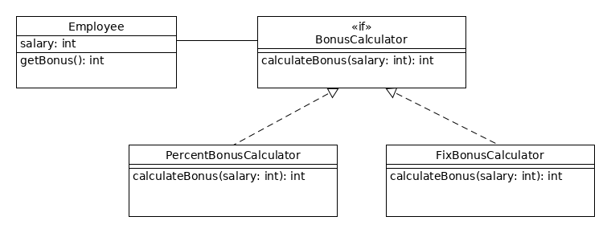
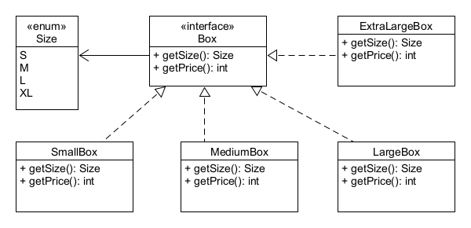
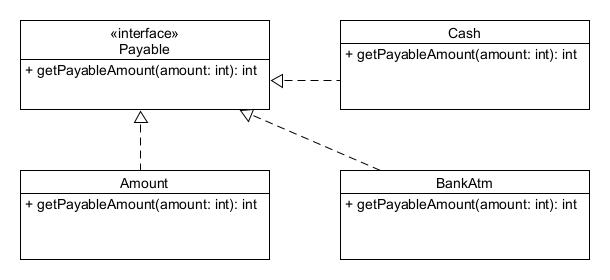
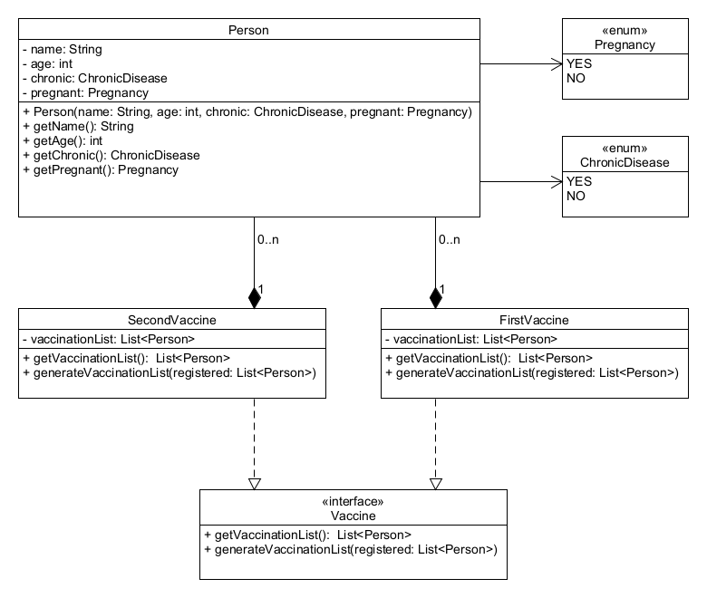

# Dependency inversion

## Elmélet

Amennyiben két osztály között függőség van, az sokszor úgy nyilvánul meg, hogy az egyik 
osztálynak van egy másik osztály típusú attribútuma. Azonban ha a másik osztály implementál 
egy interfészt, akkor az egyik osztály hivatkozhat a másik osztály helyett az interfészre is. 
Ezt **dependency inversion**-nek nevezzük, amikor a függőség nem közvetlenül az osztályra 
mutat, hanem annak egy interfészére. 

Ez azért hasznos, mert így az attribútumnak a szóban forgó interfész több különböző implementációját 
is értékül tudjuk adni, azaz az algoritmus cserélhetővé válik. Az interfész ezáltal gyakorlatilag 
egy szerződés lesz a hívó (használó) osztály és az implementáló osztály között. A hívó
osztálynak szüksége van egy bizonyos tulajdonságra (metódusra), ezért az interfészre hivatkozik, 
és ezáltal válogathat annak különböző implementációi közül.

A videóban szereplő példa:



Adott egy `BonusCalculator` interfész, amelyben található egy `int calculateBonus(int salary);` metódusfej:

```java
public interface BonusCalculator {

    int calculateBonus(int salary);
}
```

Ezt az interfészt implementálja két osztály, amelyek különböző módokon valósítják meg ezt a metódust:

```java
public class PercentBonusCalculator implements BonusCalculator {

    @Override
    public int calculateBonus(int salary) {
        return (int)(salary * 1.25);
    }
}
```

és

```java
public class FixedBonusCalculator implements BonusCalculator {

    @Override
    public int calculateBonus(int salary) {
        return salary + 10_000;
    }
}
```

Majd létrehozunk egy `Employee` osztályt, amely az alkalmazottak fizetésének kiszámításához
használni szeretné valamelyik bónusz-számító algoritmust, de különböző alkalmazottaknál 
különböző módokon szeretné a bónuszt számolni. Ehhez az `Employee` osztálynak annyit 
kell tennie, hogy nem egyenként hivatkozik a `PercentBonusCalculator` és a 
`FixedBonusCalculator` osztályokra, hanem a mindkettőjük által implementált interfészre 
hivatkozik (`BonusCalculator`), és attól kezdve szabadon használhatja bármelyik, ezt az 
interfészt implementáló osztályt:

```java
public class Employee {

    private int salary;

    private BonusCalculator bonusCalculator;

    public Employee(int salary, BonusCalculator bonusCalculator) {
        this.salary = salary;
        this.bonusCalculator = bonusCalculator;
    }

    public int getBonus() {
        return bonusCalculator.calculateBonus(salary);
    }
}
```

Látható, hogy az `Employee`-nak egy `BonusCalculator` attribútuma van, és ezáltal 
a tényleges `Employee` objektumok létrehozásakor a konstruktornak szabadon átadható 
bármilyen `BonusCalculator`, azaz bármilyen olyan osztály, amely ezt az interfészt 
implementálja:

```java
public class EmployeeMain {

    public static void main(String[] args) {
        Employee employee = new Employee(10_000, new PercentBonusCalculator());
        System.out.println(employee.getBonus());

        Employee anotherEmployee = new Employee(10_000, new FixedBonusCalculator());
        System.out.println(anotherEmployee.getBonus());
    }
}
```

## Ellenőrző kérdések

* Mit jelent a _dependency inversion_ kifejezés?
* Miért hasznos ez?
* Dependency inversion esetén mi a létrehozott változó statikus és dinamikus típusa?

## Gyakorlati feladatok

Az `interfacedependencyinversion` csomagba dolgozz!

### Gyakorlati feladat - Szállítási költség

Egy futárcég úgy határozza meg a szállítási árait, hogy csak a feladásra kerülő csomag külső méreteit kell megadni, 
és ez alapján besorolják a csomagot a négy méretkategória - és egyben árkategória - valamelyikébe. 

A `box` csomagba dolgozz!

Hozd létre a `Size` enumot, melyben a következő értékek legyenek: `S`, `M`, `L`, `XL`! Majd hozd létre a `Box` 
interfészt, amelyben két absztrakt metódust deklarálj: `Size getSize()` és `int getPrice()`! Készítsd el a 
következő osztályokat, amelyek mindegyike implementálja az interfészt: 

* `SmallBox`, amely `S` méretű és 1000 Ft-ért szállítja a futárcég.
* `MediumBox`, amely `M` méretű és 2000 Ft a szállítási díja.
* `LargeBox`, amely `L` méretű és 3000 Ft-ba kerül a küldése.
* `ExtraLargeBox`, amely `XL` méretű és 5000 Ft-ért juttatják célba.



Végül legyen egy `CourierCompany` osztályod, amelynek `main()` metódusában `Box` statikus típussal példányosítsd 
mind a különböző dobozokat reprezentáló osztályokat, és mindegyiknél írd ki a konzolra a `getSize()` és a `getPrice()` metódus 
által visszaadott értéket!

### Gyakorlati feladat - Fizetendő összeg

Az `amount` csomagban hozz létre egy `Payable` nevű interfészt, amelynek legyen egy `int getPayableAmount(int amount)` 
absztrakt metódusa! Ezt az interfészt implementálják a következő osztályok:



* Az `Amount` osztályban úgy implementáld a metódust, hogy az csak adja vissza magát az összeget, mindenféle 
  változtatás nélkül!
* A `Cash` osztályban viszont úgy, hogy a metódus a magyar fizetési kerekítések szerint adja vissza a fizetendő összeget!
  (Tehát: Ha a kapott összeg 1-re vagy 2-re végződik, akkor 0-ra kerekít, ha 3-ra, 4-re, 6-ra vagy 7-re, akkor 5-re 
  kerekít, ha pedig 8-ra vagy 9-re, akkor 10-re kerekít. Ha 5-re vagy 0-ra végződik az összeg, akkor nincs kerekítés.)
* Végül a `BankAtm` osztályban a metódus implementációja kerekítse felfelé, a legközelebbi ezresre az összeget!

Írd is meg a tesztet mindegyik osztály tesztelésére a `PayableTest` osztályban, melyben az egyes példányokat `Payable` 
statikus típusú változónak adod értékül!

### Gyakorlati feladat - Oltási sorrend

Egy járványos betegségre többféle vakcina is létezik, de nem mindegyiket kaphatja mindenki. Ez egészségi állapottól és 
életkortól függ. A helyzetet bonyolítja még az is, hogy nem mindig elérhető az összes típusú vakcina, illetve az 
is, hogy vannak a betegségre nézve kifejezetten veszélyeztetett emberek. Mivel fontos, hogy mindenki minél hamarabb 
oltást kaphasson, és ráadásul olyan típusú vakcinát, amelyet sem az életkora, sem az egészségi állapota nem zár ki, 
ezért a különböző típusú vakcinákkal való oltáskor sorrendet állítanak fel az oltásra várakozók között. 

A `vaccine` csomagba készítsd el az alábbiakat:



* `Person` osztály: `String name`, `int age`, `ChronicDisease chronic` és `Pregnancy pregnant` attribútumokkal. 
  Az osztály konstruktora állítsa be ezek értékét.
* `ChronicDisease` enum: `YES` és `NO` felsorolókkal.
* `Pregnancy` enum: `YES` és `NO` felsorolókkal.
* `Vaccine` interfész: `List<Person> getVaccinationList()` és `void generateVaccinationList(List<Person> registered)` 
  absztrakt metódusokkal.
* `FirstVaccine` osztály: implementálja a `Vaccine` interfészt. Van egy `List<Person> vaccinationList` attribútuma, 
  amely kezdetben egy üres lista. Az interfész `generateVaccinationList()` metódusának implementációja egy olyan 
  listát generál, melyben első helyen a várandósok szerepelnek, közvetlenül utánuk kell besorolni az időseket 
  (65 év felettiek) és csak utánuk jöhet mindenki más. Krónikus betegség senkinél nem kizáró ok.
* `SecondVaccine` osztály: implementálja a `Vaccine` interfészt. Van egy `List<Person> vaccinationList` attribútuma,
  amely kezdetben egy üres lista. Az interfész `generateVaccinationList()` metódusának implementációja egy olyan listát generál,
  amelyben elöl szerepelnek a fiatalok (65 évesek vagy az alattiak), és utánuk következnek az idősek (mert őket is csak akkor 
  oltják ezzel a vakcinával, ha nagyon muszáj). A listában a várandósok és a krónikus betegek ne szerepeljenek 
  (mert nem olthatóak ezzel a vakcinával, életkortól függetlenül)!
  
Írd meg a tesztet is az egyes osztályok tesztelésére a `VaccineTest` osztályban! A tesztosztálynak legyen egy `Vaccine vaccine` 
attribútuma, amelyet két különböző tesztmetódusban példányosíts, egyik esetben `FirstVaccine`, másik esetben 
pedig `SecondVaccine` dinamikus típusú példányt adj neki értékül! Az osztályban attribútumként legyen megadva az oltásra 
regisztráltak listája is, amelyet egy `@BeforeEach` annotációval ellátott metódusban készíts el (példányosítsd és adj hozzá 
néhány embert)!