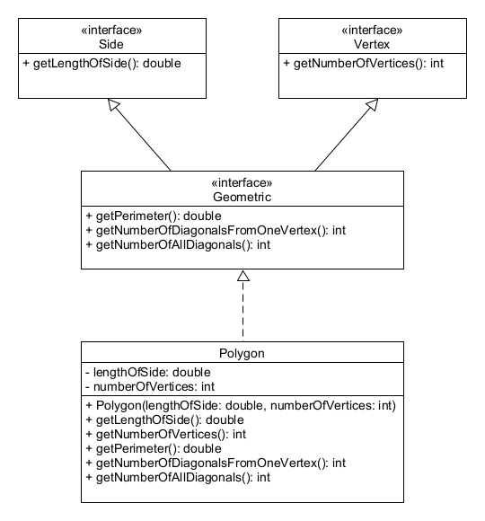
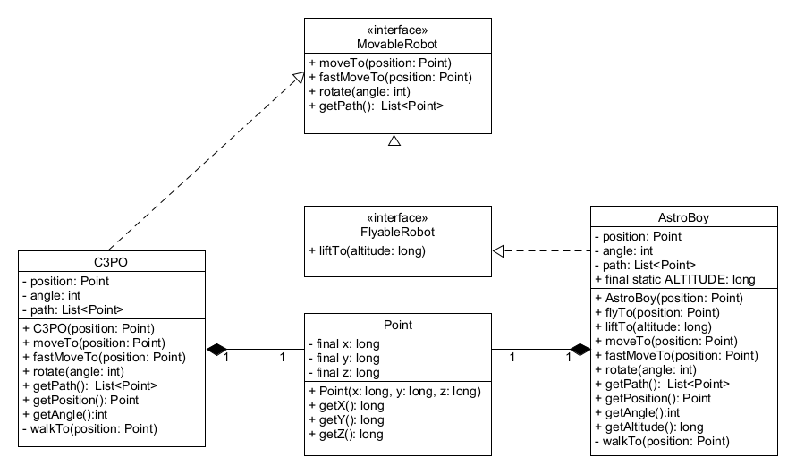

# Interfészek és az öröklődés viszonya

## Elmélet

Interfészek is képesek egymásból öröklődni. Itt is az `extends` kulcsszó használatával lehet azt elérni, 
hogy az egyik interfész kiterjessze a másikat. Az öröklődés ekkor is ugyanúgy működik, mint osztályok esetén, 
vagyis a leszármazott interfész örökli az ősében deklarált metódusokat.

Az interfészek között **többszörös öröklődés** van, azaz egy interfész több interfészt is kiterjeszthet. Ekkor 
az `extends` kulcsszó után a szülő interfészeket vesszővel elválasztva soroljuk fel. Az interfészek közötti 
kapcsolat nem hierarchikus, hanem hálós, de körkörös öröklődés nem lehet benne. Nincs olyan kitüntetett 
gyökéreleme, mint az osztályhierarchiának.

A videóban a következő példa hangzik el a körkörös öröklődésre. Ilyet nem lehetséges létrehozni, ez le sem fordul:

```java
public interface A extends B {
}
```

```java
public interface B extends A {
}
```

Egy osztály több interfészt is implementálhat, és ez esetben minden olyan metódust is implementálnia kell, amelyek 
vagy az implementált interfészekben, vagy azok ősinterfészeiben absztrakt metódusokként szerepelnek.
Amennyiben az osztály úgy dönt, hogy ezek közül valamelyik metódust absztraktnak hagyja, akkor az osztály is 
absztrakt lesz. Az első konkrét osztálynak minden örökölt absztrakt metódust implementálnia kell.

Fontos megjegyeznünk, hogy habár a specifikációk (a metódus fejlécek) többszörösen öröklődnek, 
az implementációk csak egyszeresen.

A gyakorlati videóban bemutatott első példa az interfészek öröklődésére:

```java
public interface HasName {

    String getName();
}

public interface HasNameAndAge extends HasName {

    int getAge();
}
```

A második példa:

```java
public interface HasName {

    String getName();
}

public interface HasAge {

    int getAge();
}

public interface HasNameAndAge extends HasName, HasAge{
}
```

Mindkét esetben a `Trainer` osztály az alábbi módon implementálja az egymásból öröklődő 
interfészeket és metódusaikat:

```java
public class Trainer implements HasName, HasAge {

 private String name;
 private int age;

 public Trainer(String name, int age) {
  this.name = name;
  this.age = age;
 }

 @Override
 public String getName() {
  return name;
 }

 @Override
 public int getAge() {
  return age;
 }
}
```

## Ellenőrző kérdések

* Milyen kulcsszó szükséges az interfész öröklődéshez?
* Egy interfésznek hány ősinterfésze lehet?
* Milyen módon nem lehetséges az interfészeknek egymásból öröklődniük?

## Gyakorlati feladatok

Az `interfaceextends` csomagba dolgozz!

### Gyakorlati feladat - Sokszögek

A `polygon` csomagba készítsd el a következő interfészeket és osztályt:

* `Side` interfész, amelyben van egy `double getLengthOfSide()` absztrakt metódus.
* `Vertex` interfész, amelyben van egy `int getNumberOfVertices()` absztrakt metódus.
* `Geometric` interfész, amelynek mindkét előző interfész az őse. Ebben az interfészben találhatóak a következő a
  absztrakt metódusok: `double getPerimeter()`, `int getNumberOfDiagonalsFromOneVertex()` és `int getNumberOfAllDiagonals()`
* `Polygon` osztály, amelynek van egy `double lengthOfSide` és egy `int numberOfVertices` attribútuma, és 
  implementálja a `Geometric` interfészt.
  
Az osztály konstruktora állítsa be a sokszög csúcsai számának és egy oldala hosszának az értékét! Az osztályban 
implementált metódusok feladata ezen alapadatok segítségével kiszámítani egy sokszög kerületét, valamint egy csúcsból 
induló átlóinak és összes átlójának számát.



### Gyakorlati feladat - Robotok

Egy játék során robotokat fogunk mozgatni. Alapvetően kétféle mozgást kell megvalósítani, gyaloglást és repülést.
A szükséges alapműveleteket, mint funkciókat, interfészekben definiáljuk. Az egyes konkrét robotok ezeket implementálják,
ennek megfelelően fognak majd mozogni.

A `robot` csomagba dolgozz!



Az interfészek nem függetlenek egymástól, a `MovableRobot` interfész leszármazottja a repülést megvalósító
(esetünkben a felemelkedés funkciót leíró) `FlyableRobot` interfész. A robotok mozgását a koordinátákat
tartalmazó `Point` osztály objektumai segítségével lehet követni.

A `MovableRobot` interfészben definiált metódusok a következők:

```java
void moveTo(Point position);
void fastMoveTo(Point position);
void rotate(int angle);
List<Point> getPath();
```

A `getPath()` metódus azoknak a pontoknak a listáját adja vissza, amelyeket a robot mozgása során érintett
(a konkrét mozgató utasítások minden esetben bejegyzik a célként kapott `Point` objektumot).

A `FlyableRobot extends MoveableRobot` interfészben definiált metódus:

```java
void liftTo(long altitude);
```

A `Point` osztály `final` `long x`, `long y` és `long z` attribútumokkal rendelkezik. Csak `FlyableRobot` esetében kap
a `z` attribútum nullától különböző értéket, a `MoveableRobot` síkban mozog. Konstruktora minden attribútum értékét 
beállítja.

Két robotot fogunk létrehozni, az egyik csak síkban mozog (`C3PO`), a másik repülni is tud (`AstroBoy`).

Az egyik robot: `C3PO implements MovableRobot` osztály  `Point position`, `int angle` és `List<Point> path` attribútumokkal:

* Konstruktor:

```java
public C3PO(Point position)
```

* Publikus metódusok:

```java
public void moveTo(Point position)
public void fastMoveTo(Point position)
public void rotate(int angle)
```

Mivel C3PO nem tud sietni, esetében a `moveTo()` és `fastMoveTo()` metódusok ugyanúgy működnek. Célszerű egy privát
metódust létrehozni (pl. `void walkTo(Point position)`), amely beállítja a robot új pozícióját és be is jegyzi ezt a `path`-ba.  

A másik robot: `AstroBoy implements FlyableRobot` osztály  `Point position`, `int angle` és `List<Point> path` attribútumokkal, 
valamint `long ALTITUDE = 5` konstans értékkel:

* Konstruktor:

```java
public AstroBoy(Point position)
```

* Publikus metódusok:

```java
public void flyTo(Point position)
public void liftTo(long altitude)
public void moveTo(Point position) // delegálja a funkciót
public void fastMoveTo(Point position) //komplex mozgás, felemelkedik, elrepül a célpont fölé, majd leereszkedik
public void rotate(int angle)  
```

Mindegyik mozgásos metódus bejegyzi, hogy milyen koordináták mentén történt a mozgás.

<!-- [rating feedback=java-interfaceextends-robotok] -->

