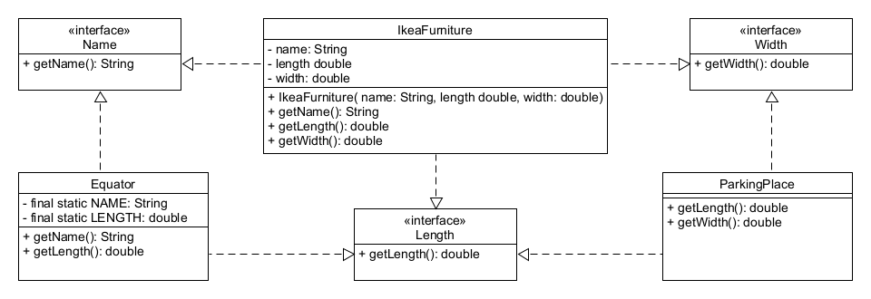
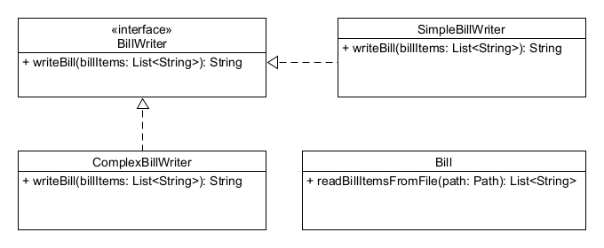

# Interfészekkel kapcsolatos szabályok

## Elmélet

A Java nyelv az interfészekkel kapcsolatosan több szabályt is megfogalmaz.

* Az interfész nem példányosítható. Mivel az interfészek csak tulajdonságokat írnak le, 
  és az osztályok pedig implementálják az interfészeket és megvalósítják ezeket a tulajdonságokat, 
  ezért csak az osztályokat lehet példányosítani.
* Az interfészt implementáló osztálynak implementálnia kell az adott interfészben található 
  absztrakt metódus(oka)t, vagy ha nem teszi ezt meg, akkor magának is absztrakt osztálynak kell lennie.
* Interfész neve előtt az `abstract` kulcsszó kiírása opcionális, viszont ettől még az interfész egy absztrakt 
  nyelvi elem (hiszen nem lehet példányosítani).
* Interfész neve elé nem írhatjuk ki a `final` módosítószót, hiszen pont az a lényege, hogy az osztályok
  implementálni tudják.
* Az interfészekben lehet attribútumokat definiálni, de ezek alapértelmezetten `public static final` 
  kulcsszavakkal jönnek létre, és így gyakorlatilag konstansként funkcionálnak. Az interfésznek 
  ezt a funkcióját ma már ritkán használjuk, helyette praktikusabb az enumok használata.
* Nem lehet példányattribútuma (hiszen nem lehet példányosítani).
* Egy osztály több interfészt is implementálhat, több tulajdonsággal is dolgozhat az adott
  osztály példánya. Ez egyben azt is jelenti, hogy az osztály példányát értékül tudjuk adni több
  különböző típussal deklarált változónak is, tehát az objektum több különböző alakban is megjelenhet.
* Figyelni kell abban az esetben, ha két különböző, implementálni kívánt interfészben 
  ugyanolyan nevű metódusok szerepelnek. Ha azonos a két metódusfej, akkor a két metódus azonosnak számít, 
  eltérő paraméterek esetén két túlterhelt metódus keletkezik majd, eltérő visszatérési érték esetén 
  viszont fordítási hiba lép fel.
  
> A videóban 3:15-nél megjelenő slide-on szereplő `instanceof` operátorral azt lehet megvizsgálni, hogy egy 
> adott objektum példánya-e egy adott osztálynak vagy interfésznek.

## Ellenőrző kérdések

* Mely kulcsszót lehet használni interfészek neve előtt és melyiket nem? Miért?
* Mit kell tudni az interfészekben definiálható attribútumokról?
* Mit jelent pontosan az, hogy "az interfész példánya"?
* Milyen lehetőségeket és milyen problémákat rejthet az, ha egy osztály több interfészt is implementál?

## Gyakorlati feladatok

Az `interfacerules` csomagba dolgozz!

### Gyakorlati feladat - Közös tulajdonságok

Ebben a feladatban egyszerűen modellezheted, hogyan köthetnek össze két teljesen különböző dolgot a 
közös tulajdonságaik. A `commonproperties` csomagba dolgozz!



* Készíts egy `Name` nevű interfészt, benne egy `String getName()` absztrakt metódussal!
* Készíts egy `Length` nevű interfészt, benne egy `double getLength()` absztrakt metódussal!
* Készíts egy `Width` nevű interfészt, benne egy `double getWidth()` absztrakt metódussal!
* Készíts egy `Equator` nevű osztályt, amely `static final` módosítószókkal ellátott attribútumokban 
  tárolja az Egyenlítő nevét és hosszát, valamint impementálja a `Name` és a `Length` 
  interfészeket! Valósítsd meg megfelelő módon a két interfész metódusait!
* Majd készíts egy `IkeaFurniture` osztályt, melynek három attribútuma van: (fantázia)név, 
  hosszúság és szélesség (ez utóbbiak lebegőpontos típusok)! Ez az osztály implementálja 
  mindhárom interfészt, és valósítsa meg úgy a metódusait, hogy mindegyik egyenként a 
  megfelelő attribútum értékét adja vissza! Legyen az osztálynak konstruktora is, mely 
  beállítja az attribútumok értékét!
* Végül készíts egy `ParkingPlace` osztályt, amelynek nincs attribútuma, viszont implementálja a 
  `Length` és a `Width` interfészeket. Mivel egy használható parkolóhely legkisebb szabványos mérete 
  2,2 méter x 5 méter, ezért a megvalósított metódusok ezeket az értékeket adják vissza!

### Gyakorlati feladat - Kétféle módon kiírt számlák

Hozz létre egy `billitems.txt` nevű fájlt a teszt ágon, a következő tartalommal:

```text
kenyér;400;1
tej;300;2
tejföl;180;2
fogkefe;200;5
```
Készíts egy `bill.Bill` osztályt, melynek `List<String> readBillItemsFromFile(Path path)` metódusa beolvassa a fájl 
tartalmát! Ezután készíts egy `BillWriter` nevű interfészt, amelynek legyen egy `String writeBill(List<String> billItems)` 
absztrakt metódusa!

Készíts egy `SimpleBillWriter` osztályt, mely implementálja a `BillWriter` interfészt, és úgy valósítja meg annak 
a metódusát, hogy az a paraméterül kapott lista alapján a következő formában adja vissza a számla tételeit:

```text
kenyér, 1 * 400 = 400 Ft
tej, 2 * 300 = 600 Ft
tejföl, 2 * 180 = 360 Ft
fogkefe, 5 * 200 = 1000 Ft
```

Majd készíts egy `ComplexBillWriter` osztályt, mely implementálja a `BillWriter` interfészt, és úgy valósítja meg annak
a metódusát, hogy az a paraméterül kapott lista alapján a következő formában adja vissza a számla tételeit:

```text
kenyér; darabszám: 1, egységár: 400, összesen: 400 Ft
tej; darabszám: 2, egységár: 300, összesen: 600 Ft
tejföl; darabszám: 2, egységár: 180, összesen: 360 Ft
fogkefe; darabszám: 5, egységár: 200, összesen: 1000 Ft
```

