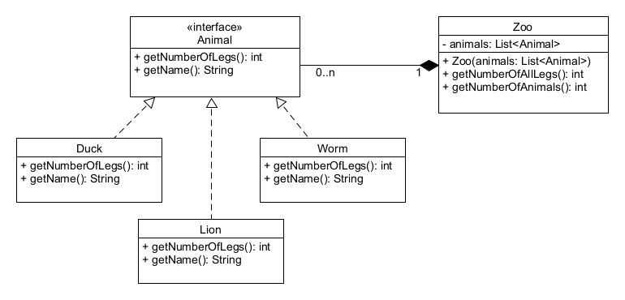
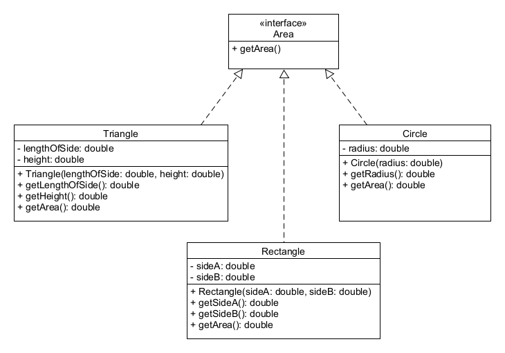

# Interfészek

## Elmélet

Az **interfész** fogalmával már más területen is találkozhattál. Jelentése: kapcsolódási felület és leírás. 
Tulajdonképpen interfésznek nevezzük egy rendszer azon elemeit, amelyen át a rendszerhez kapcsolódni lehet 
anélkül, hogy pontosan ismernénk annak belső működését. Interfészt képeznek ezért egy osztály publikus tagjai, 
de a Java nyelvben van erre egy külön nyelvi elem is.

Az **interface** olyan, osztályhoz hasonló egység, amely ezt a kapcsolódási felületet biztosítja. Előírja az 
őt implementáló osztály számára, hogy milyen publikus metódussal vagy metódusokkal kell rendelkeznie, hogy 
kompatibilis legyen más osztályokkal. Természetesen az implementáló osztály eldöntheti, hogyan valósítja meg 
az előírt metódust, de a metódus szignatúrájának meg kell egyeznie az előírttal. Ezen kívül még konstansokat 
(`public static final`) deklarálhat, melyeket kívülről az interfész nevét használva minősítőként érhetünk el.

Egy osztály több interfészt is implementálhat. Az interfészek között lehetséges a többszörös öröklődés, azaz 
egy interfésznek több őse is lehet. Mivel az interfész csak azt írja elő, hogy milyen metódust kell tartalmaznia 
az osztálynak, azért csak metódusfejeket tartalmaz, melyek mindig publikusak és absztraktak, ezért ezeket a 
módosítókat akár el is hagyhatjuk az interfészben.

```java
public interface Writable {

    int DEFAULT_CONTENT_SIZE = 100;

    boolean write(String text);
}
```

ugyanaz, mint a

```java
public interface Writable {

    public static final int DEFAULT_CONTENT_SIZE = 100;

    public abstract boolean write(String text);
}
```

Egy interfész üres is lehet, ebben az esetben jelölő (_marker_) interfésznek nevezzük. A marker interfésszel 
egy bizonyos csoporthoz való tartozást szokás jelölni. A marker interfész implementálásával gyakorlatilag 
"ráakasztunk" az osztályra egy metaadatot azért, hogy az később vizsgálható legyen valamilyen szempontból. 
Ilyen pl. a `Serializable` interfész, ami a Java beépített osztálykönyvtárának a része, és az itt található
`Flat` interfészhez hasonlóan néz ki a forráskódja:

```java
public interface Flat {
}
```

Az osztály létrehozásakor az `implements` kulcsszó után vesszővel elválasztva kell felsorolnunk azokat az 
interfészeket, amelyeket az osztály implementál. A fordító hibát jelez, ha az interfészben lévő metódust 
elfelejtjük implementálni az osztályban.

```java
public class Paper implements Writable, Erasable, Flat {

    private String content = "";

    private int maxContentSize = DEFAULT_CONTENT_SIZE;

    public Paper() {

    }

    public Paper(int maxContentSize){
        this.maxContentSize = maxContentSize;
    }

    public boolean write(String text) {
        String newContent = content + text;
        if (newContent.length() <= maxcontentSize) {
            content = newContent;
            return true;
        }
        return false;
    }

    public void erase(){
        content = "";
    }
}
```

Interfész nem példányosítható, hiszen tényleges működéssel nem rendelkezik, de lehet egy változó statikus 
típusa. Ebben az esetben az objektumból csak az interfészben deklarált metódusok érhetőek el.
A már ismert `List` is egy interfész.

```java
public static void main(String[] args) {
    Paper paper = new Paper(200);
    Writable writable = paper;
    Erasable erasable = paper;

    writable.write("alma");
    paper.write("körte");
    System.out.println(paper.getContent());	// almakörte
    erasable.erase();
    System.out.println(paper.getContent()); // (üres sor)
}
```

Mindhárom változó ugyanarra a `Paper` objektumra mutat, de a `writable` csak a `write`, az `erasable` csak 
az `erase` metódust éri el, míg a `paper` mindegyiket. Ennek igazán akkor látjuk hasznát, ha egy metódusunk 
például csak írni szeretné az objektum tartalmát anélkül, hogy tudná, milyen objektum is az valójában. 
Bármilyen jó neki, amelyik implementálja a `Writable` interfészt, hiszen ekkor biztosan meg tudja hívni 
rajta a `write` metódust.

```java
public class Printer {

    public boolean addContent(Writable writable, String content){
        return writable.write(content);
    }

    public static void main(String[] args) {
        Printer printer = new Printer();
        Paper paper = new Paper(200);
        if (printer.addContent(paper, "Ezt írjuk a papírra.")) {
            System.out.println("A papír nyomtatása sikerült");
        }
    }
}
```

Az interfészek valamelyest feloldják azt a szabályt, miszerint a Javaban csak egyszeres öröklődés van, mert 
így egy osztály sok interfésztől "örökölhet" metódusokat.

Mi történik, ha egy osztály két olyan interfészt implementál, mely ugyanolyan nevű metódust ír elő (névütközés)?

1. Ha a két metódus szignatúrája azonos, és ugyanazt a logikát akarjuk társítani hozzá, akkor nincs probléma.
2. Ha a két metódusnak más a paraméter szignatúrája, akkor mindkét metódust implementáljuk. (overload)
3. Ha a két metódusnak ugyanaz a szignatúrája, de más a visszatérési értéke (és ez nem oldható fel), akkor 
   ezek sajnos ütköznek. Nem implementálhatjuk mindkét interfészt.

## Ellenőrző kérdések

* Mit értünk interfész alatt? Milyen értelmezéseit ismered az interfész fogalomnak? Hol láttál eddig interfészeket?
* Hogyan kell Javaban interfészt deklarálni?
* Hol használható később egy interfész?
* Mit jelent az, hogy egy osztály implementál egy interfészt?
* Egy osztály implementálhat-e több interfészt?
* Milyen attribútumokat használhatunk interfészekben?
* Ha nem adjuk meg explicit módon, milyen módosítók szerepelnek az attribútumnál implicit módon?
* Ha nem adjuk meg explicit módon, milyen módosítók szerepelnek a metódusoknál implicit módon?
* Mit jelent interfészeknél a névütközés? Hogyan lehet kezelni?

## Gyakorlati feladatok

Az `interfaces` csomagba dolgozz!

### Gyakorlati feladat - Létező interfész használata

A következőkben írunk egy olyan osztályt, amely implementálja a `Runnable` interfészt.

```java
public interface Runnable {
 public abstract void run();
}
```

Ennek az interfésznek csak egy `void run()` metódusa van, amit majd nekünk kell implementálnunk.

A feladat egy olyan osztály készítése, amely megkapja a feladatok listáját,
majd végrehajtja azokat (rendre kiveszi a listából a feladatokat egyenként).

* Hozz létre egy `SimpleTasks` nevű osztályt a `interfaces.simpletasks` csomagban, amely implementálja a `Runnable` interfészt.
* Hozd létre (generáltasd le) a megfelelő metódust, amelyet megkövetel az interfész.
* Hozz létre egy `tasks` nevű privát String listát.
* Hozz létre egy getter metódust a `tasks` attribútumhoz.
* Írj egy konstruktort, ami megkapja a `tasks` listát kívülről, erre állítja be a `tasks` attribútum értékét
* A részlépések végrehajtásához hozz létre egy `private void nextStep()` metódust, amely kiveszi a legutolsó 
  elemet a `tasks` listából (amíg még van benne elem).
* A `run()` metódus implementációját úgy írd meg, hogy mindaddig hívd a `nextStep()` metódust, amíg van még feladat 
  a listában!

<!-- [rating feedback=java-interface-letezointerface] -->

### Gyakorlati feladat - Saját interfész definiálása, implementálása, használata

A következő interfészt és osztályokat mind a `interfaces.animal` csomagba tedd!



* Hozz létre egy `Animal` interfészt, amely két metódust deklarál: az `int getNumberOfLegs()` metódust, 
  amely visszaadja az állat lábainak a számát, valamint a `String getName()` metódust, amely visszaadja az állat nevét!
* Az első állat a kacsa (`Duck`) lesz, amely implementálja az `Animal` interfészt úgy, hogy a lábak száma kettő,
  a név pedig "Duck".
* A második állat az oroszlán (`Lion`) lesz, amely implementálja az `Animal` interfészt úgy, hogy a lábak száma négy,
  a név pedig "Lion"
* A harmadik állat a féreg (`Worm`) legyen, amely implementálja az `Animal` interfészt úgy, hogy a lábak száma nulla,
  a név pedig "Worm".
* Használd az előző állat példányokat az `Animal` interfész segítségével a `Zoo` osztályban! Miután létrehoztad
  a `Zoo` osztályt, szükség lesz egy `List<Animal> animals` privát attribútumra, amelyben `Animal` interfészt 
  implementáló példányok vannak. Az állatok listáját kívülről adják majd meg, ezért szükség van egy olyan konstruktorra, 
  melynek ez az egy paramétere van, és ezt a kapott listát értékül adja az attribútumnak. Hozz létre egy publikus 
  metódust `getNumberOfAnimals()` névvel, amely visszaadja, hogy hány állat található a területen (a lista mérete)!
  Hozz létre egy publikus metódust `getNumberOfAllLegs()` névvel, amely visszaadja, hogy összesen hány lába
  van az állatoknak (összegezd az állatok lábát, használva a példányok `getNumberOfLegs()` metódusát)!

<!-- [rating feedback=java-interface-sajatinterface] -->

### Gyakorlati feladat - Síkidomok

Hozd létre a `figure` csomagot és abban az `Area` interfészt, amelyben egyetlen absztrakt metódus van: `double getArea()` 
Implementálják ezt az interfészt a következő osztályok: a `Triangle`, a `Rectangle` és a `Circle`, és mindegyik 
valósítsa meg az interfészben foglalt metódust a megfelelő módon! A területek számolásához szükséges adatokat 
minden osztályban attribútumként vedd fel, és az adott osztály konstruktora állítsa be ezeknek az értékét!

