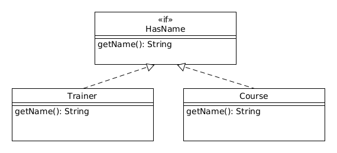

class: inverse, center, middle

# Interfészek

---

# Két interfész fogalom

* Osztályok publikus tagjai (konstruktorok és metódusok)
    * Attribútumok nem, hiszen encapsulation miatt `private` módosítószóval vannak ellátva
* Nyelvi elem
    * Önmaga nem osztály, hanem az osztállyal kapcsolatos követelményeket fogalmazza meg

---

# Interfész

* Osztályhoz hasonlatosan egy típus
* `interface` kulcsszó
* Elnevezési konvenciók mint osztály esetén, gyakran az `-able` utótaggal
* Osztály implementálhatja az `implements` kulcsszó használatával, egy újabb megjelenési formája, ebben az alakban is megjelenhet a példány
* A példány értékül adható az interfész típusú <br /> változónak
* Üres interfész: marker interface
* Nem példányosítható

---

# Marker interface példa

```java
public interface Human {}
```

```java
public class Trainer implements Human {
  
}
```

Használata:

```java
Trainer trainer = new Trainer("John Doe");
Human human = trainer;
```

---

# Metódust tartalmazó interface

* Fontos tulajdonság kiemelése, annak jelzése, hogy ezzel a metódussal rendelkeznie kell
* Metódusoknál hiányzó törzs
* Metódusok alapértelmezetten `public` és `abstract` módosítószóval
* Kötelező részleteket ad a példánynak, képességet
* Vagy implementálnia kell a metódust, <br /> vagy absztrakt osztálynak kell lennie

---

# Metódust tartalmazó interface kód

```java
public interface HasName {
  String getName();  
}
```

```java
public class Trainer implements HasName {
  
  private String name;
  
  public Trainer(String name) {
    this.name = name;
  }
  
  public String getName() {
    return name;
  }
}
```

---

# Példányosítás

```java
HasName hasName = new Trainer("John Doe");
System.out.println(hasName.getName());
```

---

# Egy interfészt több osztály implementálhat

* Nem öröklődési hierarchiában szereplő osztályok közös tulajdonságainak kiemelésére

---

# Egy interfészt több osztály implementálhat kód

```java
public class Course implements HasName {
  
  private String name;
  
  public Course(String name) {
    this.name = name;
  }
  
  public String getName() {
    return name;
  }
}
```

---

# Példányosítás

```java
HasName trainer = new Trainer("John Doe");
HasName course = new Course("Java");
System.out.println(trainer.getName());
System.out.println(course.getName());
```

---

# UML diagram

